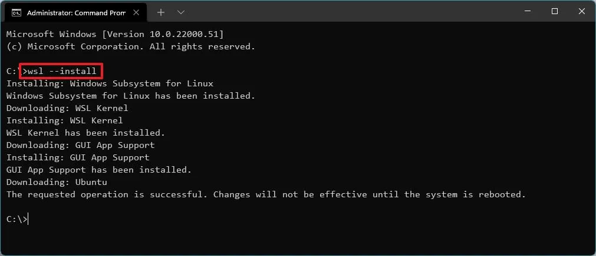
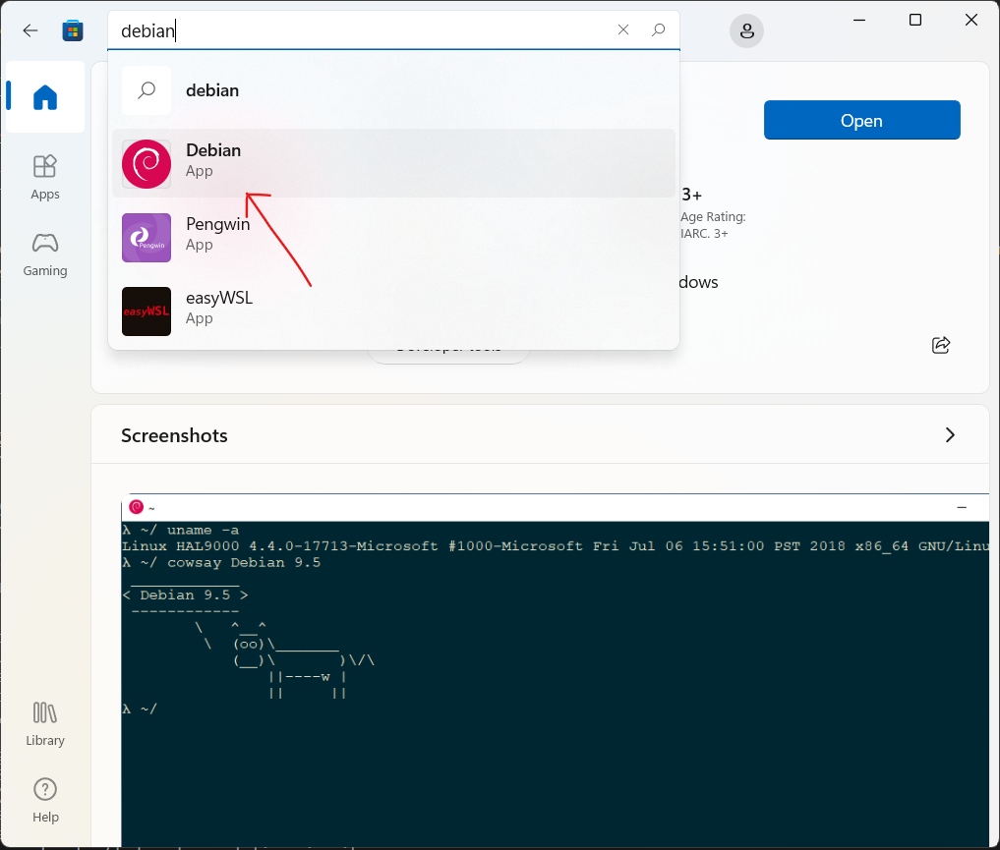
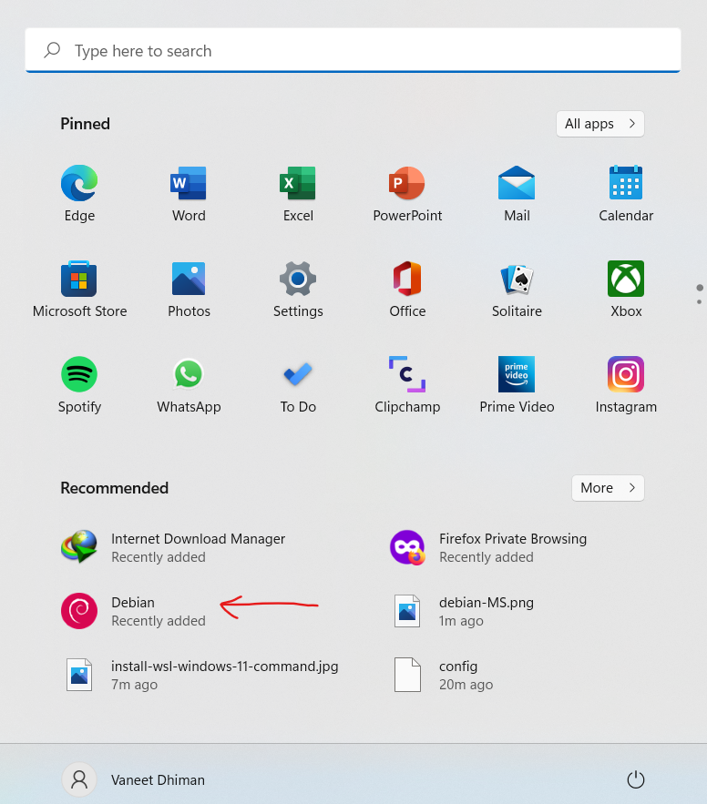
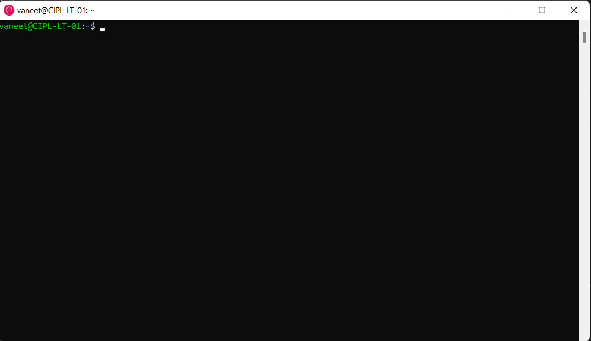
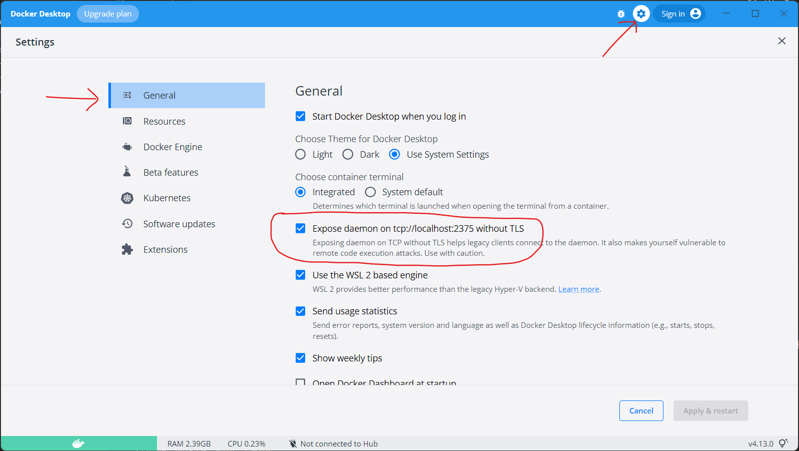
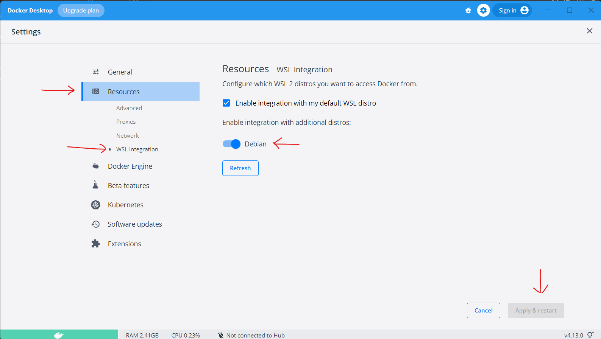
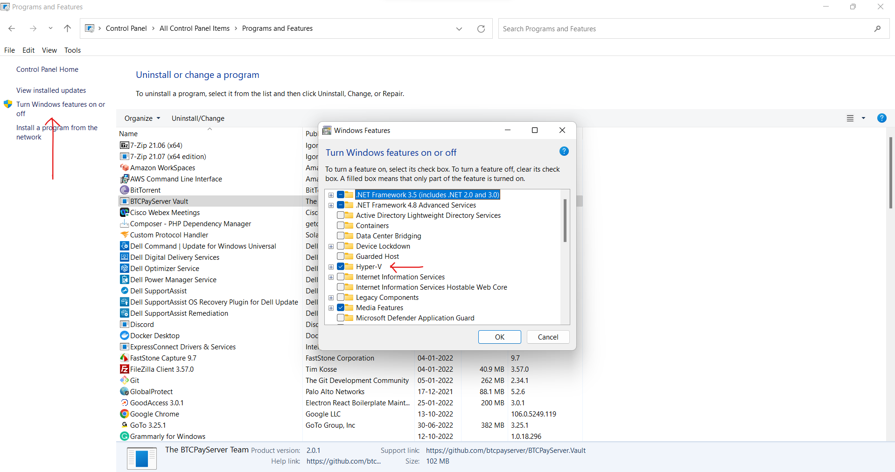

# Introduction
Please follow this documentation for setting up the local development environment with Docker on your local machine.

## Project Folder Structure
```
Projects
|__magento_v243_website
|__PricingAPI
|__flatdesigner_nodejs
|__docker
```

#### GIT
Please make sure that you have `git clone` all the required repositories on to your machine before proceeding further. If you don't have **GIT** already installed on your machine, please install it using the following [steps](https://git-scm.com/book/en/v2/Getting-Started-Installing-Git).

#### Docker
Also make sure that **docker** is installed on your machine. If not, please download and install it using below links.

[Linux](https://docs.docker.com/desktop/install/linux-install/)

[Windows](https://docs.docker.com/desktop/install/windows-install/)

[macOS](https://docs.docker.com/desktop/install/mac-install/)

## Install WSL on Windows OS
WSL means Windows Subsystem for Linux from Microsoft which lets developers run a Linux environment -- including most command line tools, utilities, and applications -- directly on Windows.
**How to install WSL on Windows 10 & 11**
1. Open **Command Prompt** as an **Administrator** on your Windows machine.
2. Type the following to install the WSL on Windows 10 & 11 and press **Enter**.
   ```
   wsl --install
   ```
   
3. Restart your computer to finish the WSl installation on Windows 10 & 11.

## Linux Distro Setup
1. Open **Microsoft Store** on your machine and install `Debain App`.
   

2. After successful installation, you should be able to open it from the `Start` window.
   

3. After opening it, you should see a terminal like below.
   

4. On opening it first time, it would ask you set the password for your user. After setting the password, please run the below commands.
   ```
   $ sudo su -
   <Type Your Password>
   $ apt-get update
   $ apt install wget curl net-tools vim iputils-ping telnet -y
   $ ln -s /c/Program\ Files/Docker/Docker/resources/bin/docker.exe /usr/local/bin/docker
   $ ln -s /c/Program\ Files/Docker/Docker/resources/bin/docker-compose.exe /usr/local/bin/docker-compose
   $ apt-get install ruby ruby-dev -y
   $ gem install docker-sync
   $ echo "export DOCKER_HOST=tcp://127.0.0.1:2375" >> ~/.bashrc
   $ apt-get install build-essential -y
   $ apt-get install make -y
   $ wget https://caml.inria.fr/pub/distrib/ocaml-4.12/ocaml-4.12.0.tar.gz
   $ tar xvf ocaml-4.12.0.tar.gz
   $ cd ocaml-4.12.0
   $ ./configure
   $ make world
   $ make opt
   $ umask 022
   $ make install
   $ make clean
   $ wget https://github.com/bcpierce00/unison/archive/refs/tags/v2.52.1.tar.gz
   $ tar xvf v2.52.1.tar.gz
   $ cd unison-2.52.1
   $ make UISTYLE=text
   $ cp src/unison /usr/local/bin/unison
   $ cp src/unison-fsmonitor /usr/local/bin/unison-fsmonitor
   $ mkdir /code
   $ mount --bind <path-to-project-folder-on-windows> /code
   $ echo "sudo mount --bind <path-to-project-folder-on-windows> /code" >> ~/.bashrc && source ~/.bashrc
   $ sudo visudo
   ```
Add the following at the bottom of the file, replacing "username" with your WSL username.
   ```
   username ALL=(root) NOPASSWD: /bin/mount
   ```

## HyperV and Docker setup
1. Open `Docker Desktop` application on your Windows machine and goto `Settings` and in `General` tab please enable the checkbox for `Expose daemon on   tcp://localhost:2375 without TLS` as shown in the image below.
   

2. Go to `WSL Integration` under `Resources` tab and enable the integration with the newly setup Linux Distro, in our case it is Debian and click on `Apply & restart` as shown in the image below.
   

3. Open `Control Panel` on your Windows machine and click on `Programs and Features`, after that click on `Turn Windows features on or off`, it will open a small window, please make sure that **Hyper-V** option is enabled in that small window.
   

4. Restart your computer.