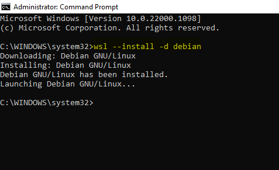
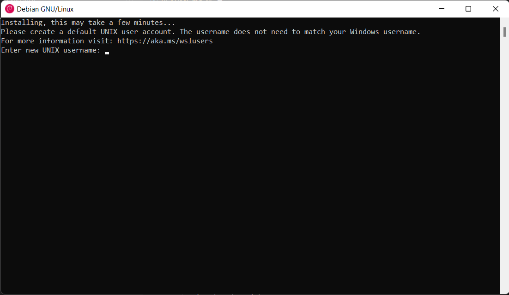
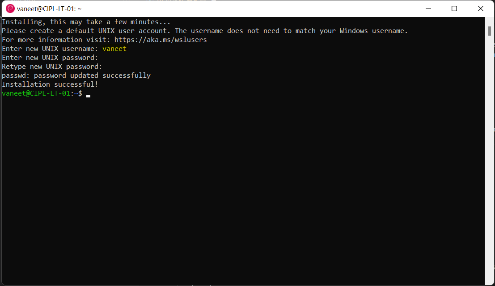
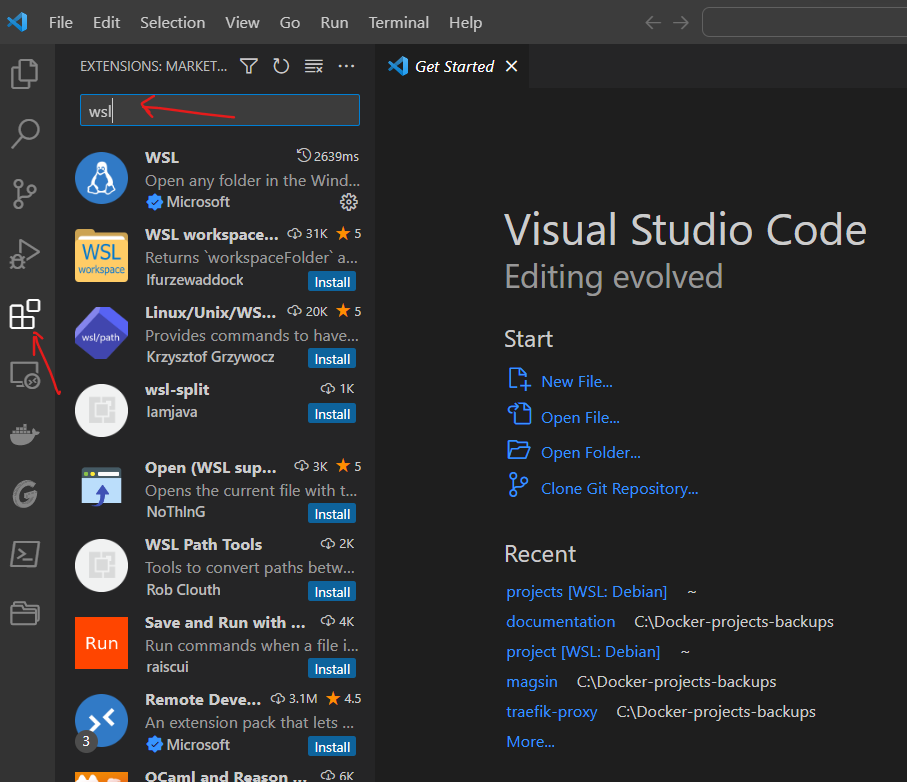
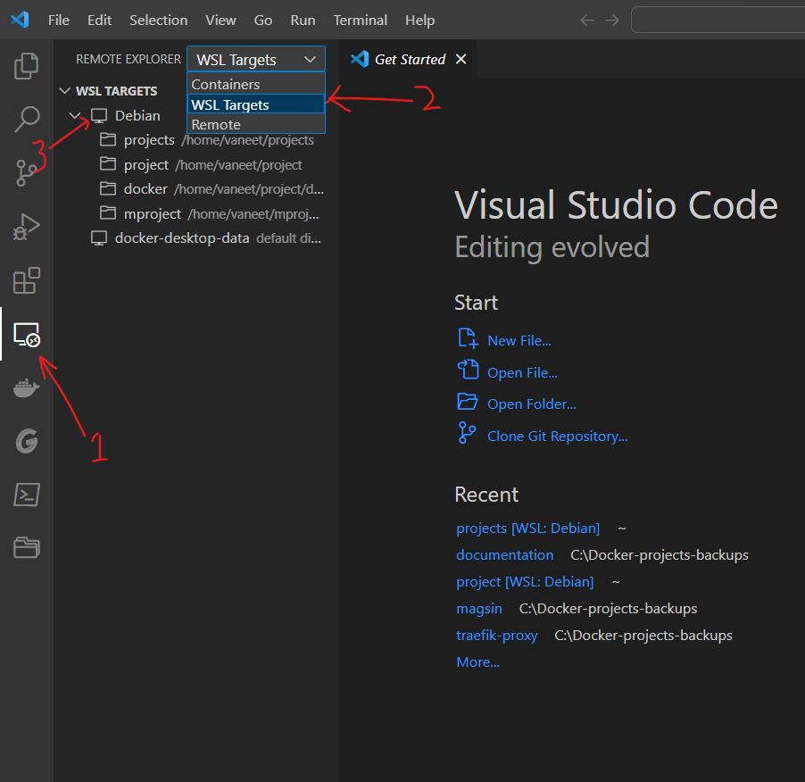
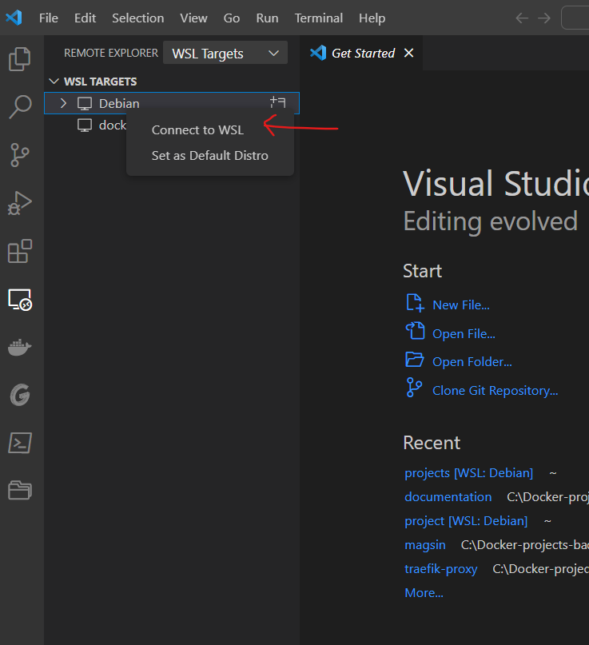
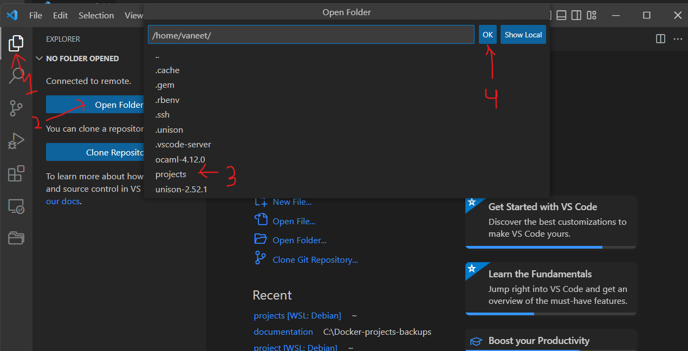
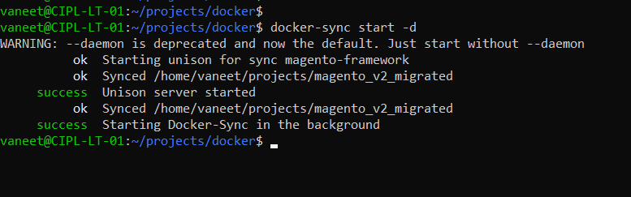

# Introduction
Please follow this documentation **step-by-step** for setting up the local development environment with Docker on your local machine.

#### GIT
Please make sure that you have `git clone` all the required repositories on to your machine before proceeding further. If you don't have **GIT** already installed on your machine, please install it using the following [steps](https://git-scm.com/book/en/v2/Getting-Started-Installing-Git).

#### Docker
Also make sure that **docker** is installed on your machine. If not, please download and install it using below links.

[Linux](https://docs.docker.com/desktop/install/linux-install/)

[Windows](https://docs.docker.com/desktop/install/windows-install/)

[macOS](https://docs.docker.com/desktop/install/mac-install/)

## Install WSL Distro on Windows OS
WSL means Windows Subsystem for Linux from Microsoft which lets developers run a Linux environment -- including most command line tools, utilities, and applications -- directly on Windows.
**How to install WSL on Windows 10 & 11**
1. Open **Command Prompt** as an **Administrator** on your Windows machine.
2. Type the following to install the WSL on Windows 10 & 11 and press **Enter**.
   ```
   wsl --install -d Debian
   ```
   
3. After it is completed, it will open a `Debian Terminal` like shown in the image below.
   
4. Enter **Username** and **Password** you want to set for your Debian App.
   
5. After setting up the username and password, install basic utilities on the Debian terminal.
   ```
   $ sudo apt-get update
   $ sudo apt-get install telnet git net-tools vim curl sudo wget iputils-ping less unzip -y
   ```
6. Now we will create `Project` folder in the home directory using below command on Debian terminal.
   ```
   $ mkdir Project
   ```
7. Now `git clone` the **Magento website**, download **Flatdesigner_nodejs API**, and also download **docker** folder to the `Project` directory.
   ```
   $ cd ~/Project
   $ git clone https://github.com/sinalite/magento_v2_migrated.git
   $ cd magento_v2_migrated
   $ git checkout release-magento2-upgrade
   $ cd ~/Project
   $ wget http://104.251.216.173/Downloads/flatdesigner_nodejs.zip
   $ unzip flatdesigner_nodejs.zip
   $ wget http://104.251.216.173/Downloads/docker.zip
   $ unzip docker.zip
   $ sudo rm -rf flatdesigner_nodejs.zip
   $ sudo rm -rf docker.zip
   ```
**After performing above steps, you will have folder structure similar to shown below.**

## Project Folder Structure
```
Project
|__magento_v2_migrated
|__flatdesigner_nodejs
|__docker
```

## Install and setup Docker and its dependencies

1. Fist we will be installing the **Docker** using below commands.
   ```
   $ cd ~/
   $ sudo apt-get update
   $ sudo apt install apt-transport-https ca-certificates curl gnupg lsb-release ssh make autoconf bison build-essential libssl-dev libyaml-dev libreadline6-dev zlib1g-dev libncurses5-dev libffi-dev libgdbm3 libgdbm-dev -y
   $ sudo mkdir -p /etc/apt/keyrings
   $ sudo curl -fsSL https://download.docker.com/linux/debian/gpg | sudo gpg --dearmor -o /etc/apt/keyrings/docker.gpg
   $ sudo echo \
     "deb [arch=$(dpkg --print-architecture) signed-by=/etc/apt/keyrings/docker.gpg] https://download.docker.com/linux/debian \
     $(lsb_release -cs) stable" | sudo tee /etc/apt/sources.list.d/docker.list > /dev/null
   $ sudo apt-get update
   $ sudo apt-get install docker-ce docker-ce-cli containerd.io docker-compose-plugin docker-compose -y
   $ sudo usermod -aG docker $USER
   $ sudo update-alternatives --set iptables /usr/sbin/iptables-legacy
   $ sudo update-alternatives --set ip6tables /usr/sbin/ip6tables-legacy
   $ sudo mkdir /sys/fs/cgroup/systemd
   $ sudo mount -t cgroup -o none,name=systemd cgroup /sys/fs/cgroup/systemd/
   $ exit
   ```
2. Now open the **Debian** terminal from **Start** option in Windows and setup **ruby** using below commands.
   ```
   $ git clone https://github.com/rbenv/rbenv.git ~/.rbenv
   $ sudo echo 'export PATH="$HOME/.rbenv/bin:$PATH"' >> ~/.bashrc
   $ sudo echo 'eval "$(rbenv init -)"' >> ~/.bashrc
   $ git clone https://github.com/rbenv/ruby-build.git ~/.rbenv/plugins/ruby-build
   $ exit
   ```
3. Now open again the **Debian** terminal from **Start** option in Windows and setup **docker-sync** and **unison** using below commands.
   ```
   $ rbenv install 2.7.6
   $ rbenv global 2.7.6
   $ gem install docker-sync
   $ cd ~/
   $ wget --no-check-certificate https://caml.inria.fr/pub/distrib/ocaml-4.12/ocaml-4.12.0.tar.gz
   $ tar xvf ocaml-4.12.0.tar.gz
   $ cd ocaml-4.12.0
   $ sudo ./configure
   $ sudo make world
   $ sudo make opt
   $ umask 022
   $ sudo make install
   $ sudo make clean
   $ cd ~/
   $ wget https://github.com/bcpierce00/unison/archive/refs/tags/v2.52.1.tar.gz
   $ tar xvf v2.52.1.tar.gz
   $ cd unison-2.52.1
   $ sudo make UISTYLE=text
   $ sudo cp src/unison /usr/local/bin/unison
   $ sudo cp src/unison-fsmonitor /usr/local/bin/unison-fsmonitor
   ```

**So now we have completed the _Docker_ setup and folder/files setup.** But it is in the _`Debian`_ terminal yet and can't be accessed in **_Visual Studio_** for development purposes. So in order to access the **_Project_** folder in `VS Code`, please follow below steps.

1. Open **_Visual Studio_** window on your system and click on _`Extensions`_ tab and search **wsl** in the search tab, as shown in the image below.

2. Install the first option which shows up in the search index and restart the **_Visual studio_**. Now click on _`Remote Explorer`_ and select **_WSL Targets_** from the drop-down menu and after selecting it, you should see the **_Debian_** option right below as shown in the image below.

3. From there, Right-Click on **Debian** and choose **_Connect to WSL_** as shown in the image below. It will open a new VS Code window.

4. On the new VS window, click on **Explorer**, then **Open Folder** and you will see a dropdown to chose from, select folder **Project** and you are good to go, as shown in the image below.


#### Now it is time to setup things on _Magento_ side. First, create the custom folders which are not present in the GIT.
```
$ cd ~/Project/magento_v2_migrated
$ mkdir -p pub/media/customer_images
$ mkdir -p pub/media/customer_images/digitized_embroidery
$ mkdir -p pub/media/customer_images/generated
$ mkdir -p pub/media/customer_images/library
$ mkdir -p pub/media/customer_images/uploaded
$ mv pub/media/catalog/category pub/media/catalog/category-orig
$ mv pub/media/catalog/product pub/media/catalog/product-orig
$ mkdir -p pub/media/catalog/category
$ mkdir -p pub/media/catalog/product
```

>Next step would be to setup **_MySQL_** configuration within the `Magento` code.
```
$ cd ~/Project
$ cp app/etc/env.bak.php app/etc/env.php
```

>Now open the file **_app/etc/env.php_** in the VS Code editor and change the below piece of code.
```
'db' => [
        'table_prefix' => '',
        'connection' => [
            'default' => [
                'host' => '127.0.0.1',
                'dbname' => 'magento_v2_20181204',
                'username' => 'root',
                'password' => '666666',
                'active' => '1'
            ]
        ]
    ],
```
#### TO
```
'db' => [
        'table_prefix' => '',
        'connection' => [
            'default' => [
                'host' => 'mysql',
                'dbname' => 'magento',
                'username' => 'root',
                'password' => 'qazxcde1231',
                'active' => '1'
            ]
        ]
    ],
```

Also delete the line **_'save_path' => 'D://workspace//magento_v2_merged//var//session//'_** in `app/etc/env.php`.

In last, we will start the **_Docker_** services and import MySQL database and we are ready to do the development. Please follow below steps to start **docker-sync** services first.
```
$ cd ~/Project/docker
$ sudo service docker restart
$ docker-sync start -d
```
The `docker-sync start -d` will take few minutes to complete and will show the output as shown below.


The next step is to start **docker** containers. Please follow the below steps for that.
```
$ cd ~/Project/docker
$ docker-compose up -d --build
```
`docker-compose up -d --build`` will take few (10-15) minutes to set up everything first time. After it is complete, it's time to import **_MySQL database_** into the container.
First download the **SQL** file bby following the below steps.
```
$ cd ~/Project/docker/sql-db
$ wget http://104.251.216.173/Downloads/db.zip
$ unzip db.zip
$ rm db.zip
```
Now import the database using below commands.
```
$ docker exec -it mysql bash
$ mysql -u root -p magento < docker-entrypoint-initdb.d/db.sql
```
The above command will ask for the password and the password is **_qazxcde1231_**. Type the password on the terminal, it will take few (15-20) minutes to import the database and after it is complete, run the below command.
```
$ exit
```
